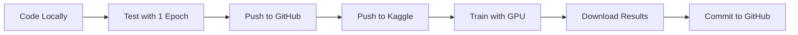

# Heart Image Segmentation with 3D UNet

A production-ready deep learning pipeline for automatic heart segmentation from 3D medical images using MONAI and PyTorch. This project is designed for seamless local development, GitHub version control, and Kaggle GPU training.

## Key Features

### **Unified Workflow**

- **Local Development**: Code and test on your machine with 1-epoch quick runs
- **GitHub Integration**: Version control with automatic artifact tracking
- **Kaggle Training**: Seamlessly push and train with free GPU/TPU resources

### **Advanced Training Features**

- **3D UNet Architecture**: State-of-the-art medical image segmentation
- **Automatic Mixed Precision (AMP)**: 2-3x faster training on GPU
- **Data Augmentation**: Random flips, rotations, and intensity shifts
- **Learning Rate Scheduling**: Adaptive LR with plateau detection
- **Checkpoint Resuming**: Recover from interruptions automatically
- **CacheDataset**: 5-10x faster data loading with intelligent caching

### **Monitoring & Visualization**

- **TensorBoard Integration**: Real-time training metrics visualization
- **Interactive Notebook**: Explore data, visualize results, and test inference
- **Comprehensive Metrics**: Dice score, loss curves, and model performance tracking

## Dataset

This project uses the **Task02_Heart** dataset from the [Medical Segmentation Decathlon](https://medicaldecathlon.com/):

- **Source**: [Kaggle - Medical Segmentation Decathlon Heart](https://www.kaggle.com/datasets/thisisrick25/medical-segmentation-decathlon-heart)
- **Contents**: 20 cardiac MRI scans with expert segmentation labels
- **Format**: NIfTI (.nii.gz)
- **Auto-download**: The script automatically downloads the dataset on first run (local environment only)

## Project Structure

```
├── train.py              # Main training script (local + Kaggle compatible)
├── config.py             # Centralized configuration (paths, hyperparameters)
├── test.ipynb            # Interactive notebook for exploration & visualization
├── utilities.py          # Training utilities and metrics
├── requirements.txt      # Python dependencies
├── kernel-metadata.json  # Kaggle kernel configuration
├── results/              # Model checkpoints, metrics, TensorBoard logs
└── datasets/             # Downloaded dataset (local only, gitignored)
```

## Quick Start

### Local Development

1. **Clone the repository**

   ```bash
   git clone https://github.com/thisisrick25/heart-image-segmentation.git
   cd heart-image-segmentation
   ```

2. **Install dependencies**

   ```bash
   pip install -r requirements.txt
   ```

3. **Configure Kaggle API** (for dataset download)

   - Create `~/.kaggle/kaggle.json` with your Kaggle API credentials
   - Or create `~/.kaggle/access_token.txt` with your access token

4. **Run training** (1 epoch locally for testing)

   ```bash
   python train.py
   ```

   The script will:

   - Auto-download the dataset to `datasets/`
   - Train for 1 epoch (configurable in `config.py`)
   - Save checkpoints to `results/`

5. **Monitor with TensorBoard**

   ```bash
   tensorboard --logdir=results/tensorboard_logs
   ```

   Open http://localhost:6006 to view training curves in real-time.

6. **Explore data interactively**

   ```bash
   jupyter notebook test.ipynb
   ```

### Kaggle Training

1. **Push to Kaggle Kernel**

   ```bash
   kaggle kernels push
   ```

2. **Run on Kaggle**

   - The kernel will automatically use the attached dataset
   - Trains for 20 epochs (configurable in `config.py`)
   - GPU acceleration with AMP enabled

3. **Auto-sync Results to GitHub** (Automated via GitHub Actions)

   After training completes:

   a. Go to GitHub → Actions tab → "Sync Kaggle Training Artifacts"

   b. Click "Run workflow" and enter your Kaggle kernel slug

   c. The workflow will:

   - Download artifacts from Kaggle
   - Commit to `results/` with metrics in commit message
   - Create a summary with Dice scores

   **One-time setup:**

   - Add Kaggle API credentials to GitHub Secrets:
     - `KAGGLE_USERNAME`: Your Kaggle username
     - `KAGGLE_KEY`: Your Kaggle API key (from kaggle.json)

## Workflow



## Configuration

Edit `config.py` to customize training:

```python
# Training parameters
MAX_EPOCHS = 20              # Full training epochs (Kaggle)
MAX_EPOCHS_LOCAL = 1         # Quick test epochs (local)
BATCH_SIZE = 1               # Batch size (limited by 3D volume size)
LEARNING_RATE = 1e-5         # Initial learning rate
TRAIN_RATIO = 0.8            # 80% train, 20% validation

# Model parameters
SPATIAL_SIZE = [128, 128, 64]  # Input volume size
PIXDIM = (1.5, 1.5, 1.0)       # Voxel spacing
```

## Features in Detail

### Automatic Mixed Precision (AMP)

- Reduces memory usage by 50%
- Speeds up training by 2-3x on modern GPUs
- Automatic fallback to FP32 on CPU

### Checkpoint Resuming

- Saves `last_checkpoint.pth` after every epoch
- Automatically resumes if training is interrupted
- Preserves: model, optimizer, scheduler, metrics, scaler state

### Data Augmentation

- Random flips (X, Y, Z axes)
- Random 90° rotations
- Random intensity shifts (±10%)
- Only applied during training

### Learning Rate Scheduling

- Monitors validation Dice score
- Reduces LR by 50% if no improvement for 5 epochs
- Helps achieve better convergence

## Results

The model is evaluated using the Dice similarity coefficient:

- **Training**: Real-time monitoring via TensorBoard
- **Validation**: Evaluated every epoch
- **Best Model**: Automatically saved based on validation Dice score
- **Checkpoints**: Full training state saved for resuming

Example outputs are visualized in `test.ipynb`.

## Tech Stack

- **Deep Learning**: PyTorch, MONAI
- **Medical Imaging**: NiBabel, SimpleITK
- **Data Processing**: NumPy, SciPy
- **Visualization**: Matplotlib, TensorBoard
- **Notebooks**: Jupyter, ipywidgets
- **APIs**: Kaggle API

## Contributing

Contributions are welcome! Feel free to:

- Report bugs
- Suggest features
- Submit pull requests

## License

This project is open source and available under the MIT License.

## Acknowledgments

- **Dataset**: [Medical Segmentation Decathlon](http://medicaldecathlon.com/)
- **Framework**: [MONAI - Medical Open Network for AI](https://monai.io/)
- **Platform**: [Kaggle](https://www.kaggle.com/) for free GPU resources

## References

- [Medical Segmentation Decathlon Paper](https://arxiv.org/abs/1902.09063)
- [MONAI Documentation](https://docs.monai.io/)
- [3D U-Net: Learning Dense Volumetric Segmentation](https://arxiv.org/abs/1606.06650)
