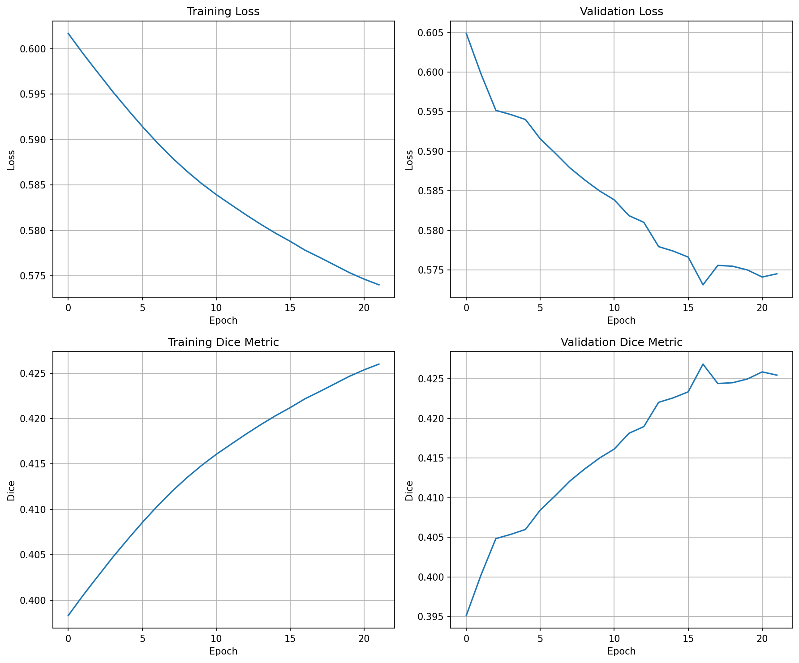

# Training Summary
**Best Validation Dice**: 0.8115 at epoch 78
**Final Training Loss**: 0.1289
**Final Validation Loss**: 0.2004
**Final Training Dice**: 0.8711
**Final Validation Dice**: 0.7996
**Epochs Run**: 93
**Duration (s)**: 2440.1

### Artifacts
- Best model: /kaggle/working/best_metric_model.pth
- Last checkpoint: /kaggle/working/last_checkpoint.pth
- Training plot: /kaggle/working/training_metrics.png
- TensorBoard logs: /kaggle/working/tensorboard_logs

